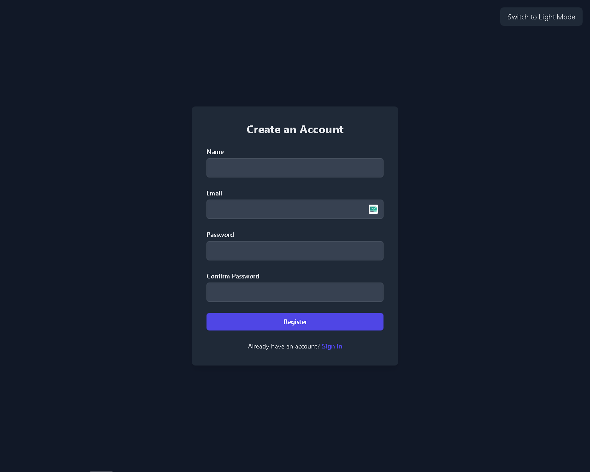
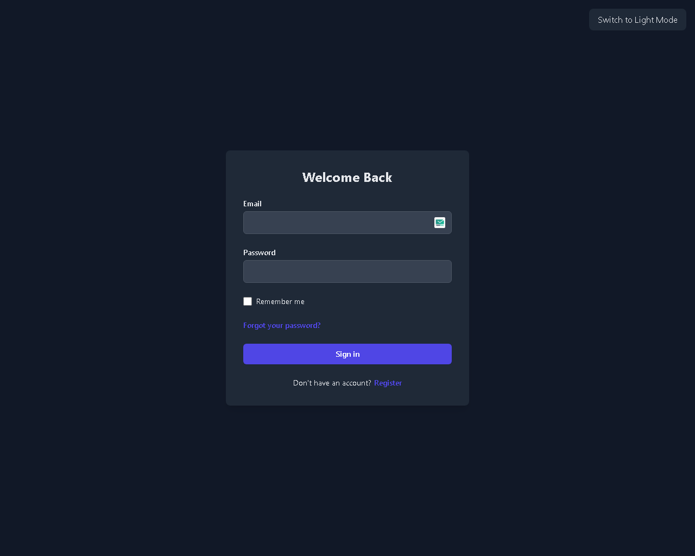

# Login and Registration System

This repository contains a login and registration system implemented with modern HTML, CSS, and JavaScript. It provides a simple way to integrate user authentication into web applications.

## Features

- **User Registration:** Allows users to create new accounts.
- **Login:** Allows existing users to sign in to their accounts.
- **Form Validation:** Uses client-side form validation to enhance the user experience.
- **Modern Interface:** The interface is designed with modern CSS for an attractive and responsive look.

## Usage

1. Clone this repository to your local machine.
2. Open the `index.html` file in your browser.
3. To test registration, fill out the registration form and click "Sign Up".
4. To test login, use the account created in the previous step and click "Login".

## Screenshots

  
Registration Page

  

  
Login Page

  

## Contributing

If you would like to contribute to this project, please follow these steps:

1. Fork the repository.
2. Create a new branch (`git checkout -b feature/feature-name`).
3. Make your changes and commit (`git commit -am 'Add new feature'`).
4. Push to the branch (`git push origin feature/feature-name`).
5. Open a Pull Request.

## License

This project is licensed under the [MIT License](LICENSE).
